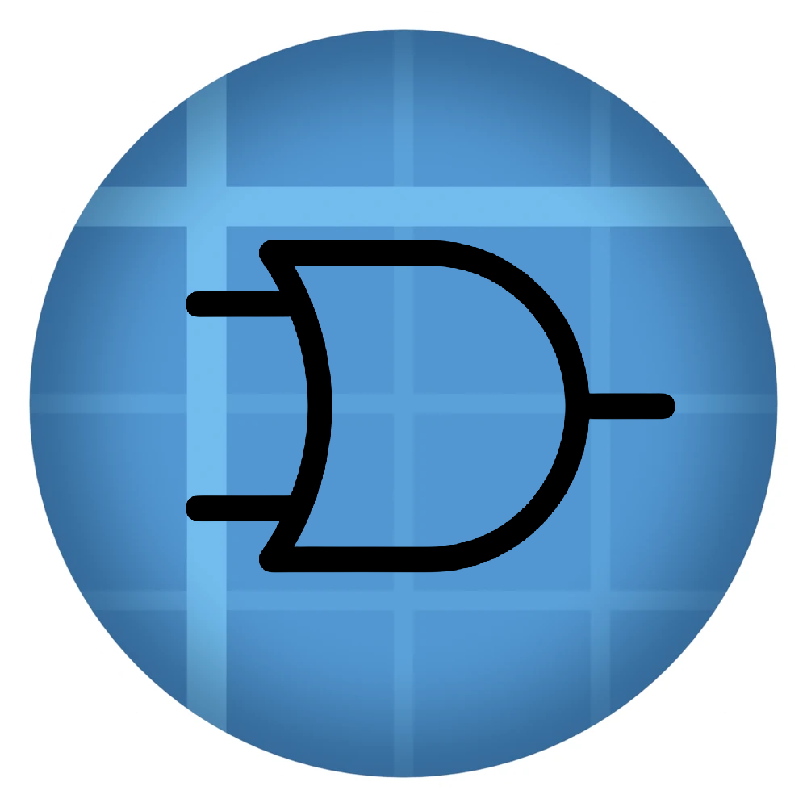
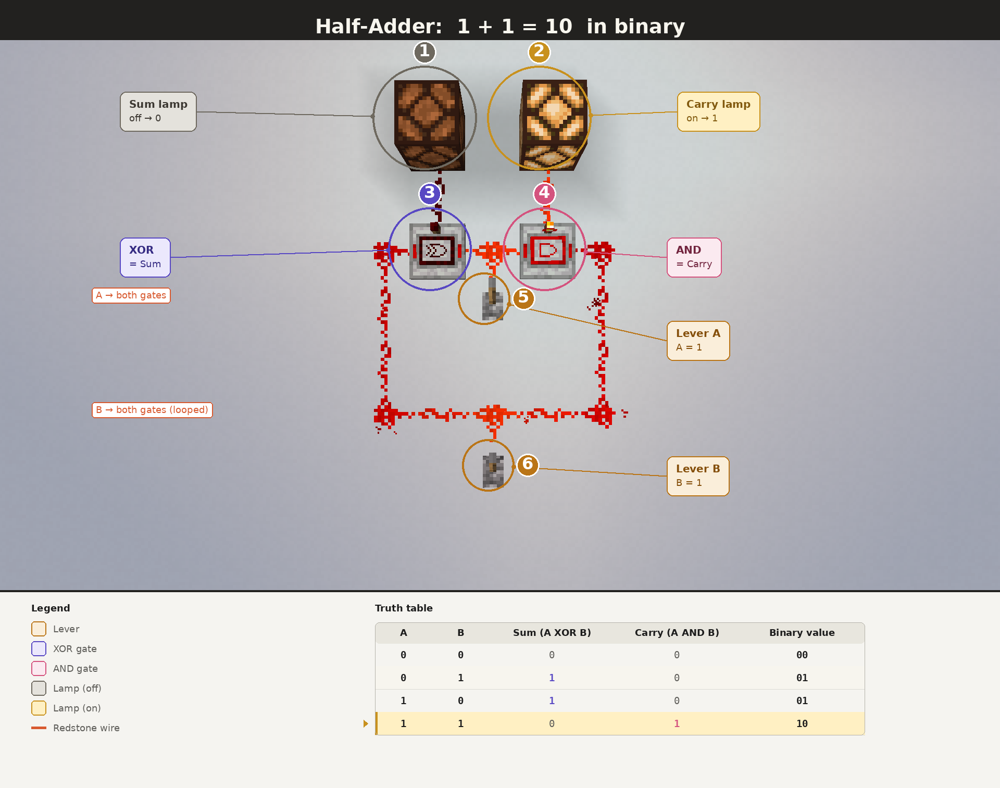
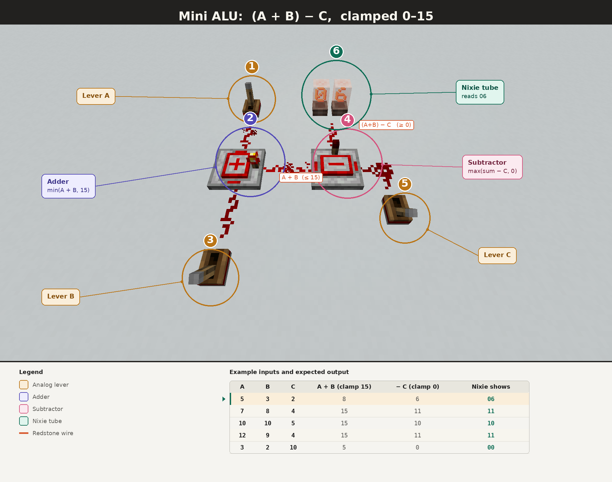

<h1 align="center">Create: Circuits</h1>

  

Create addon for NeoForge 1.21.1 that adds logic gates, signal arithmetic, and memory elements.

<h2 align="center">Download</h2>

  
  

<h2 align="center">Features</h2>

<h3 align="center">Logic Gates</h3>

  AND, OR, NOT 
  NAND, NOR, XOR, XNOR

<h3 align="center">Arithmetic Blocks</h3>

  Adder 
  Subtractor 
  Multiplier 
  Min / Max

<h3 align="center">Memory</h3>

  SR Latch

<h3 align="center">Ponder Scenes</h3>

  In-game tutorials for each gate and arithmetic block

<h2 align="center">Annotated Builds</h2>

  

  

<h2 align="center">Requirements</h2>

  Minecraft 1.21.1 (NeoForge 21.1.206+) 
  Create 6.0.9+

<h2 align="center">About</h2>

  The goal is to keep Create’s look and feel while expanding circuit-style gameplay 
  with readable blocks, consistent signal behavior, and compact builds.

